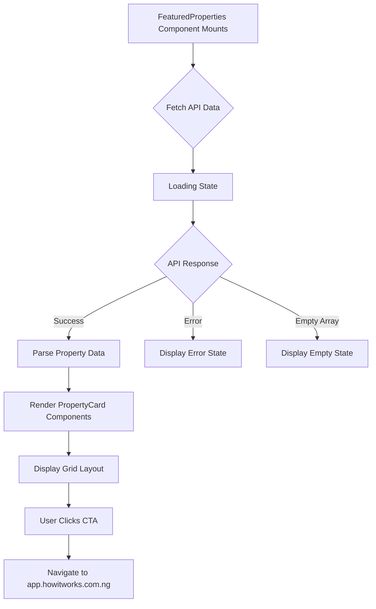

# Design Document: Featured Properties Section

## Overview

The Featured Properties Section is a new React component that bridges the marketing website and the property listing application by displaying curated property listings from the backend API. This component will be positioned immediately after the Hero Section on the homepage and will follow the established design system patterns used in IntroSection, CorePlatforms, and FeatureShowcase2 components.

### Design Goals

1. **Visual Consistency**: Match the existing design system including colors, typography, spacing, and component styles
2. **Performance**: Optimize for fast loading with Next.js Image optimization and efficient API fetching
3. **Responsiveness**: Provide excellent user experience across mobile, tablet, and desktop devices
4. **Accessibility**: Ensure semantic HTML and keyboard navigation support
5. **Conversion**: Drive traffic to the property listing app through compelling CTAs

### Key Features

- Fetch real property data from NestJS backend API
- Display 3-6 featured properties in a responsive grid
- Show essential property information: image, title, location, price, type, verification status
- Handle loading, error, and empty states gracefully
- Use Next.js 16+ features including optimized Image component
- Implement smooth animations matching existing components

---

## Architecture

### Component Hierarchy

```
FeaturedProperties (Parent Component)
├── Section Header
│   ├── Section Badge (with colored dot)
│   ├── Heading (h2)
│   ├── Description Paragraph
│   └── CTA Button
├── Property Grid Container
│   └── PropertyCard[] (Child Components)
│       ├── Property Image (Next.js Image)
│       ├── Verification Badge (conditional)
│       ├── Property Title
│       ├── Property Location
│       ├── Property Price
│       └── Property Type
└── State Components
    ├── Loading State
    ├── Error State
    └── Empty State
```

### Data Flow



### State Management

The component will use React's built-in state management:

- **Loading State**: Boolean flag indicating API request in progress
- **Error State**: Error object or string for failed requests
- **Properties Data**: Array of property objects from API
- **No external state management library required** (Redux, Zustand, etc.)

---

## API Integration Design

### API Endpoint

- **URL**: `https://howitworks-production.up.railway.app/api/properties/featured`
- **Method**: `GET`
- **Response Format**: JSON array of property objects

### Fetching Strategy

**Option 1: Client-Side Fetching (Recommended for this use case)**

```typescript
// Using React useEffect + fetch
useEffect(() => {
  const fetchProperties = async () => {
    setLoading(true);
    try {
      const response = await fetch('https://howitworks-production.up.railway.app/api/properties/featured');
      if (!response.ok) throw new Error('Failed to fetch properties');
      const data = await response.json();
      setProperties(data.slice(0, 6)); // Limit to 6 properties
    } catch (error) {
      setError(error);
    } finally {
      setLoading(false);
    }
  };
  fetchProperties();
}, []);
```

**Rationale**: Client-side fetching is appropriate because:
- Properties data changes frequently
- Section is below the fold (after Hero Section)
- No SEO benefit from server-side rendering property listings
- Allows for loading states and progressive enhancement

### Error Handling

1. **Network Errors**: Catch fetch failures and display user-friendly message
2. **HTTP Errors**: Check response.ok and handle 4xx/5xx status codes
3. **Timeout Handling**: Implement timeout with AbortController (10 seconds)
4. **Malformed Data**: Validate response structure before rendering
5. **Graceful Degradation**: Display error state without breaking page layout

### Caching Strategy

- **No aggressive caching**: Properties should be fresh on each visit
- **Browser cache**: Rely on standard HTTP cache headers from API
- **Revalidation**: Consider stale-while-revalidate pattern if API supports it
- **Future enhancement**: Could implement SWR (stale-while-revalidate) library for better UX

### Request Optimization

- **Limit results**: Request only featured properties (API responsibility)
- **Timeout**: Set 10-second timeout to prevent hanging requests
- **Abort on unmount**: Cancel request if component unmounts
- **Single request**: No pagination or infinite scroll needed

---

## Components and Interfaces

### FeaturedProperties Component

**File**: `app/components/FeaturedProperties.tsx`

**Responsibilities**:
- Fetch property data from API on mount
- Manage loading, error, and success states
- Render section header with CTA
- Render grid of PropertyCard components
- Handle empty state when no properties available

**Props**: None (self-contained component)

**State**:
```typescript
const [properties, setProperties] = useState<Property[]>([]);
const [loading, setLoading] = useState<boolean>(true);
const [error, setError] = useState<string | null>(null);
```

### PropertyCard Component

**File**: `app/components/FeaturedProperties.tsx` (internal component)

**Responsibilities**:
- Display single property information
- Render optimized image with Next.js Image
- Show verification badge if property is verified
- Handle missing/null data gracefully
- Apply hover animations and transitions

**Props**:
```typescript
interface PropertyCardProps {
  property: Property;
  index: number; // For staggered animations
}
```

### Loading State Component

**Responsibilities**:
- Display skeleton loaders or spinner
- Maintain layout structure during loading
- Match section styling

### Error State Component

**Responsibilities**:
- Display user-friendly error message
- Maintain section vertical spacing
- Optionally include retry button

### Empty State Component

**Responsibilities**:
- Display "No featured properties available" message
- Maintain section vertical spacing
- Optionally include CTA to explore all properties

---

## Data Models

### TypeScript Interfaces

```typescript
/**
 * Property object structure from API
 */
interface Property {
  id: string;
  title: string;
  location: string;
  price: number;
  propertyType: string;
  imageUrl: string;
  isVerified: boolean;
  // Optional fields
  description?: string;
  bedrooms?: number;
  bathrooms?: number;
  area?: number;
}

/**
 * API response structure
 */
interface FeaturedPropertiesResponse {
  properties: Property[];
  total?: number;
}

/**
 * Component state types
 */
type LoadingState = 'idle' | 'loading' | 'success' | 'error';

/**
 * Error object structure
 */
interface FetchError {
  message: string;
  statusCode?: number;
}
```

### Data Validation

Before rendering, validate that each property has required fields:
```typescript
const isValidProperty = (prop: any): prop is Property => {
  return (
    typeof prop.id === 'string' &&
    typeof prop.title === 'string' &&
    typeof prop.location === 'string' &&
    typeof prop.price === 'number' &&
    typeof prop.imageUrl === 'string'
  );
};
```

### Price Formatting

Properties will display prices in Nigerian Naira format:
```typescript
const formatPrice = (price: number): string => {
  return new Intl.NumberFormat('en-NG', {
    style: 'currency',
    currency: 'NGN',
    minimumFractionDigits: 0,
  }).format(price);
};
```

---

## Responsive Layout Design

### CSS Grid Implementation

The responsive grid adapts to three breakpoints:

**Mobile (< 640px)**:
- Single column layout
- Full-width cards
- `grid-cols-1`

**Tablet (640px - 1023px)**:
- Two-column layout
- Equal-width cards
- `sm:grid-cols-2`

**Desktop (≥ 1024px)**:
- Three-column layout
- Equal-width cards
- `lg:grid-cols-3`

### Grid Spacing

Following patterns from IntroSection and CorePlatforms:
- **Mobile**: `gap-5` (1.25rem / 20px)
- **Desktop**: `gap-6` (1.5rem / 24px)

### Container Structure

```typescript
<div className="relative mx-auto max-w-6xl px-6 sm:px-8 lg:px-12">
  {/* Section header */}
  <div className="mx-auto mb-10 max-w-3xl text-center lg:mb-12">
    {/* Badge, heading, description */}
  </div>
  
  {/* Property grid */}
  <div className="grid gap-5 sm:grid-cols-2 lg:grid-cols-3 lg:gap-6">
    {/* PropertyCard components */}
  </div>
</div>
```

### Card Aspect Ratio

Property cards will use a consistent aspect ratio for images:
- **Image aspect ratio**: `aspect-[1.15]` (slightly wider than square)
- **Card structure**: Flexible height based on content
- **Image behavior**: `object-cover` to maintain aspect without distortion

---

## Visual Design Specifications

### Color Palette

Following the established design system from `app/globals.css`:

| Element | Color | CSS Variable | Hex Value |
|---------|-------|--------------|-----------|
| Primary text / headings | Primary | `--primary` | `#1A2A52` |
| Body text | Text body | `--text-body` | `#3A3A3C` |
| Secondary accent (CTA, badges) | Secondary | `--secondary` | `#1FD2AF` |
| Alternative accent | Accent | `--accent` | `#FFB300` |
| Background | Neutral | `--neutral` | `#F4F5F7` |
| Light background | - | - | `#F7F8FA` |
| White surface | - | - | `#FFFFFF` |

### Section-Level Styling

```css
/* Section background */
background: #F7F8FA

/* Section padding */
padding: py-16 sm:py-20 lg:py-24
/* Translates to: 4rem (64px) → 5rem (80px) → 6rem (96px) */
```

### Typography

**Headings** (Urbanist font family):
```css
/* Section heading (h2) */
font-family: var(--font-urbanist)
font-size: text-3xl sm:text-4xl lg:text-5xl
/* 1.875rem → 2.25rem → 3rem */
font-weight: font-semibold (600)
line-height: leading-tight (1.25)
color: #1A2A52
```

**Body text** (Lato font family):
```css
/* Description paragraph */
font-family: var(--font-lato)
font-size: text-base sm:text-lg
/* 1rem → 1.125rem */
line-height: leading-relaxed (1.625)
color: #3A3A3C
```

**Property card title**:
```css
font-family: var(--font-urbanist)
font-size: text-xl sm:text-2xl
font-weight: font-semibold (600)
color: #1A2A52
```

**Property details** (location, type):
```css
font-family: var(--font-lato)
font-size: text-sm sm:text-base
color: #3A3A3C opacity-70
```

### Border Radius

Following patterns from CorePlatforms and IntroSection:

| Element | Class | Value |
|---------|-------|-------|
| Property card | `rounded-4xl` or `rounded-[1.75rem]` | 1.75rem (28px) |
| Section badge | `rounded-full` | 9999px |
| Verification badge | `rounded-full` | 9999px |
| CTA button | `rounded-full` | 9999px |
| Decorative accent bar | `rounded-full` | 9999px |

### Borders

Following CorePlatforms pattern:
```css
/* Property card border */
border: border border-white/75
/* 1px solid rgba(255, 255, 255, 0.75) */

/* Card background with opacity */
background: bg-white/82
/* rgba(255, 255, 255, 0.82) */
```

### Spacing

**Vertical spacing within cards**:
- Padding: `p-6 sm:p-7 lg:p-8`
- Internal gaps: `space-y-3` or `space-y-4`

**Section spacing**:
- Container horizontal padding: `px-6 sm:px-8 lg:px-12`
- Max width: `max-w-6xl` (72rem / 1152px)
- Margin auto for centering: `mx-auto`

### Section Badge Design

Following IntroSection pattern:
```typescript
<div className="mb-4 inline-flex items-center gap-3 rounded-full border border-[#1A2A52]/10 bg-white px-4 py-2 text-xs font-semibold uppercase tracking-[0.24em] text-[#1A2A52]/70">
  <span className="h-2 w-2 rounded-full bg-[#1FD2AF]" />
  Featured Properties
</div>
```

### Verification Badge Design

```typescript
<div className="absolute left-4 top-4 rounded-full bg-white/92 px-3 py-1.5 text-xs font-semibold uppercase tracking-[0.2em] text-[#1FD2AF]">
  Verified
</div>
```

### CTA Button Design

Following HeroSection pattern:
```typescript
<a
  href="https://app.howitworks.com.ng/"
  target="_blank"
  rel="noopener noreferrer"
  className="rounded-full bg-[#1FD2AF] px-8 py-4 text-center font-medium text-white transition-all duration-300 hover:bg-[#1AB89A]"
>
  View All Properties
</a>
```

---

## State Management

### Loading State

**Display during**:
- Initial component mount
- API request in progress

**Visual implementation**:
```typescript
{loading && (
  <div className="grid gap-5 sm:grid-cols-2 lg:grid-cols-3 lg:gap-6">
    {[1, 2, 3, 4, 5, 6].map((i) => (
      <div key={i} className="animate-pulse rounded-[1.75rem] border border-white/75 bg-white/82 p-6">
        <div className="aspect-[1.15] w-full rounded-2xl bg-gray-200" />
        <div className="mt-4 h-6 w-3/4 rounded bg-gray-200" />
        <div className="mt-2 h-4 w-1/2 rounded bg-gray-200" />
      </div>
    ))}
  </div>
)}
```

### Success State

**Display when**:
- API request successful
- Properties array has at least one property

**Data handling**:
- Limit to 6 properties maximum
- Map over properties array to render PropertyCard components
- Apply staggered animation delays

### Error State

**Display when**:
- Network error occurs
- API returns non-2xx status code
- Request times out
- Malformed response data

**Visual implementation**:
```typescript
{error && (
  <div className="mx-auto max-w-2xl rounded-[1.75rem] border border-white/75 bg-white/82 p-8 text-center">
    <p className="text-lg text-[#3A3A3C]">
      Unable to load featured properties at this time. Please try again later.
    </p>
  </div>
)}
```

### Empty State

**Display when**:
- API returns empty array
- No featured properties available

**Visual implementation**:
```typescript
{properties.length === 0 && !loading && !error && (
  <div className="mx-auto max-w-2xl rounded-[1.75rem] border border-white/75 bg-white/82 p-8 text-center">
    <p className="text-lg text-[#3A3A3C]">
      No featured properties available at this time. Check back soon!
    </p>
  </div>
)}
```

---

## Animation Specifications

### Existing Animation Classes

From `app/globals.css`, the following animations are available:

| Animation | Keyframes | Duration | Easing |
|-----------|-----------|----------|--------|
| `animate-fade-in-up` | fadeInUp | 1s | ease-out |
| `animate-fade-in` | fadeIn | 1.2s | ease-out |
| `animate-slide-in-left` | slideInLeft | 0.8s | ease-out |
| `animate-slide-in-right` | slideInRight | 0.8s | ease-out |
| `animate-scale-in` | scaleIn | 0.6s | ease-out |

### Animation Delay Classes

Available delays:
- `animation-delay-200` (200ms)
- `animation-delay-400` (400ms)
- `animation-delay-600` (600ms)
- `animation-delay-800` (800ms)

### Section Animation Strategy

**Section header**:
```typescript
<div className="animate-fade-in-up">
  {/* Badge, heading, description */}
</div>
```

**Property cards** (staggered appearance):
```typescript
<article
  className={`animate-scale-in animation-delay-${index * 200}`}
>
  {/* Card content */}
</article>
```

**Calculated delays**:
- Card 0: No delay
- Card 1: `animation-delay-200`
- Card 2: `animation-delay-400`
- Card 3: `animation-delay-600`
- Card 4: `animation-delay-800`
- Card 5: `animation-delay-800` (reuse max delay)

### Hover Animations

**Property card hover**:
```css
.property-card {
  transition: transform 0.3s cubic-bezier(0.4, 0, 0.2, 1), 
              box-shadow 0.3s cubic-bezier(0.4, 0, 0.2, 1);
}

.property-card:hover {
  transform: translateY(-8px);
  box-shadow: 0 20px 40px rgba(26, 42, 82, 0.12);
}
```

**CTA button hover**:
```typescript
className="transition-all duration-300 hover:bg-[#1AB89A]"
```

---

## Image Optimization

### Next.js Image Component Configuration

**Basic implementation**:
```typescript
import Image from "next/image";

<Image
  src={property.imageUrl}
  alt={`${property.title} in ${property.location}`}
  fill
  sizes="(max-width: 640px) 100vw, (max-width: 1024px) 50vw, 33vw"
  className="object-cover"
  priority={index < 3} // Priority for first 3 images
/>
```

### Image Configuration Details

**Layout**: `fill`
- Allows image to fill parent container
- Requires parent to have `position: relative`
- Maintains aspect ratio with `object-cover`

**Sizes attribute**:
- Mobile (< 640px): `100vw` (full viewport width)
- Tablet (640px - 1023px): `50vw` (2 columns = 50% viewport)
- Desktop (≥ 1024px): `33vw` (3 columns = 33% viewport)

**Priority loading**:
- First 3 cards: `priority={true}` (loads immediately)
- Remaining cards: Default lazy loading

**Object fit**:
- `object-cover`: Maintains aspect ratio, crops to fit
- Prevents image distortion

### Fallback Image Handling

**Missing image URL**:
```typescript
const imageUrl = property.imageUrl || '/placeholder-property.jpg';
```

**Image loading error**:
```typescript
<Image
  src={property.imageUrl}
  alt={alt}
  fill
  sizes="..."
  className="object-cover"
  onError={(e) => {
    e.currentTarget.src = '/placeholder-property.jpg';
  }}
/>
```

### Image Container

```typescript
<div className="relative aspect-[1.15] w-full overflow-hidden rounded-2xl bg-gray-100">
  <Image ... />
</div>
```

- `relative`: Required for `fill` layout
- `aspect-[1.15]`: Maintains consistent card heights
- `overflow-hidden`: Clips image to rounded corners
- `rounded-2xl`: Matches design system
- `bg-gray-100`: Fallback background during loading

---

## Error Handling

### Network Error Handling

**Scenario**: Network is unavailable or request fails

**Implementation**:
```typescript
try {
  const response = await fetch(API_URL, {
    signal: AbortSignal.timeout(10000), // 10 second timeout
  });
  
  if (!response.ok) {
    throw new Error(`HTTP ${response.status}: ${response.statusText}`);
  }
  
  const data = await response.json();
  setProperties(data);
} catch (error) {
  if (error.name === 'TimeoutError') {
    setError('Request timed out. Please check your connection.');
  } else if (error.name === 'AbortError') {
    // Request was cancelled, do nothing
  } else {
    setError('Unable to load properties. Please try again later.');
  }
}
```

### HTTP Error Handling

**4xx errors**: Client-side errors
- 400 Bad Request: Log error, show generic message
- 404 Not Found: Show "No properties found" message
- 429 Too Many Requests: Show rate limit message

**5xx errors**: Server-side errors
- 500 Internal Server Error: Show "Server error" message
- 503 Service Unavailable: Show "Service temporarily unavailable"

### Malformed Data Handling

**Validation before rendering**:
```typescript
const validProperties = data.filter(isValidProperty);

if (validProperties.length === 0) {
  setError('No valid properties found');
  return;
}

setProperties(validProperties.slice(0, 6));
```

### Missing Property Fields

**Handle optional/missing fields**:
```typescript
const PropertyCard = ({ property }: PropertyCardProps) => {
  const title = property.title || 'Untitled Property';
  const location = property.location || 'Location not specified';
  const price = property.price || 0;
  const imageUrl = property.imageUrl || '/placeholder.jpg';
  
  // Render with fallback values
};
```

### Component Unmount Cleanup

**Cancel pending requests**:
```typescript
useEffect(() => {
  const abortController = new AbortController();
  
  const fetchProperties = async () => {
    try {
      const response = await fetch(API_URL, {
        signal: abortController.signal,
      });
      // ... handle response
    } catch (error) {
      if (error.name !== 'AbortError') {
        setError(error.message);
      }
    }
  };
  
  fetchProperties();
  
  return () => {
    abortController.abort(); // Cleanup on unmount
  };
}, []);
```

---

## Testing Strategy

### Unit Testing

**Property card rendering**:
- Verify all property fields display correctly
- Test missing/null field handling
- Verify verification badge shows conditionally
- Test price formatting
- Test image alt text generation

**State transitions**:
- Test loading → success state
- Test loading → error state
- Test loading → empty state
- Verify cleanup on unmount

**Data validation**:
- Test `isValidProperty` function with valid properties
- Test with missing required fields
- Test with invalid data types

### Integration Testing

**API integration**:
- Mock successful API responses
- Mock error responses (4xx, 5xx)
- Mock timeout scenarios
- Mock empty responses
- Verify correct error messages display

**Component integration**:
- Verify FeaturedProperties renders in page layout
- Test CTA button navigation
- Test external link attributes (`target="_blank"`, `rel="noopener"`)

### Visual Regression Testing

**Responsive layouts**:
- Screenshot mobile layout (375px, 640px)
- Screenshot tablet layout (768px, 1024px)
- Screenshot desktop layout (1280px, 1536px)

**Component states**:
- Screenshot loading state
- Screenshot success state with 3 properties
- Screenshot success state with 6 properties
- Screenshot error state
- Screenshot empty state

### Accessibility Testing

**Automated checks**:
- Run axe-core or similar tool
- Verify no accessibility violations
- Check color contrast ratios
- Verify heading hierarchy

**Manual checks**:
- Keyboard navigation through cards and CTA
- Screen reader announcement testing
- Focus visible states
- Alt text meaningful and descriptive

### Performance Testing

**Metrics to measure**:
- Time to First Contentful Paint (FCP)
- Largest Contentful Paint (LCP) - should be < 2.5s
- Cumulative Layout Shift (CLS) - should be < 0.1
- Image loading performance

**Optimization verification**:
- Verify images use Next.js optimization
- Check network tab for image sizes
- Verify lazy loading works
- Check bundle size impact

---

## Accessibility Considerations

### Semantic HTML

```typescript
<section aria-labelledby="featured-properties-heading">
  <div>
    <h2 id="featured-properties-heading">
      Featured Properties
    </h2>
    <p>Browse our curated selection...</p>
  </div>
  
  <div role="list">
    {properties.map((property) => (
      <article key={property.id} role="listitem">
        {/* Property card content */}
      </article>
    ))}
  </div>
</section>
```

### Keyboard Navigation

**Tab order**:
1. Property cards (if clickable)
2. CTA button
3. Next focusable element on page

**Focus styles**:
```css
.property-card:focus-visible,
.cta-button:focus-visible {
  outline: 2px solid #1FD2AF;
  outline-offset: 4px;
}
```

### ARIA Labels

**Image alt text**:
```typescript
alt={`${property.title} - ${property.propertyType} in ${property.location}`}
```

**CTA button**:
```typescript
<a
  href="https://app.howitworks.com.ng/"
  target="_blank"
  rel="noopener noreferrer"
  aria-label="View all available properties on our property listing platform"
>
  View All Properties
</a>
```

**Loading state**:
```typescript
<div role="status" aria-live="polite">
  <span className="sr-only">Loading properties...</span>
  {/* Visual loading indicators */}
</div>
```

**Error state**:
```typescript
<div role="alert" aria-live="assertive">
  {errorMessage}
</div>
```

### Color Contrast

All text must meet WCAG AA standards:
- **Normal text**: Minimum 4.5:1 contrast ratio
- **Large text**: Minimum 3:1 contrast ratio

**Verified combinations**:
- `#1A2A52` on `#FFFFFF`: 11.4:1 ✓
- `#3A3A3C` on `#F7F8FA`: 9.8:1 ✓
- `#FFFFFF` on `#1FD2AF`: 4.6:1 ✓

### Screen Reader Support

**Landmarks**:
```typescript
<section aria-label="Featured Properties">
```

**Hidden text for context**:
```typescript
<span className="sr-only">Price: </span>
<span aria-label={formatPrice(property.price)}>
  {formatPrice(property.price)}
</span>
```

---

## Performance Optimization

### Image Optimization

**Strategies**:
1. Use Next.js Image component (automatic optimization)
2. Set appropriate `sizes` attribute for responsive loading
3. Lazy load images beyond first 3 (default Next.js behavior)
4. Use `priority` prop for above-the-fold images
5. Compress source images to < 200KB before upload

**Expected improvements**:
- 60-80% reduction in image file sizes
- Automatic WebP/AVIF format conversion
- Responsive image srcset generation

### API Request Optimization

**Strategies**:
1. Limit results to 6 properties maximum
2. Implement 10-second timeout to prevent hanging
3. Cancel request on component unmount
4. No polling or unnecessary refetches

**Future enhancements**:
- Implement SWR for stale-while-revalidate pattern
- Cache API response in localStorage for repeat visits
- Prefetch data on page load (server-side)

### Code Splitting

**Component size**:
- Single file component < 10KB gzipped
- No heavy dependencies required
- Minimal impact on bundle size

**Dynamic imports** (if needed in future):
```typescript
const FeaturedProperties = dynamic(() => import('./FeaturedProperties'), {
  loading: () => <LoadingSkeleton />,
  ssr: false, // Client-side only
});
```

### Rendering Optimization

**React optimization techniques**:
1. Use React.memo for PropertyCard if needed
2. Avoid inline function definitions in render
3. Use stable keys (property.id) in map operations
4. Minimize re-renders with proper state management

**Example**:
```typescript
const PropertyCard = React.memo(({ property, index }: PropertyCardProps) => {
  // Card implementation
});
```

### Layout Shift Prevention

**Strategies**:
1. Reserve space for loading state with skeletons
2. Use aspect-ratio for image containers
3. Set explicit heights for text containers
4. Avoid content that causes layout jumps

**Target**: CLS score < 0.1

---

## Implementation Checklist

### Phase 1: Setup and API Integration

- [ ] Create `FeaturedProperties.tsx` component file
- [ ] Define TypeScript interfaces (Property, API response)
- [ ] Implement API fetch function with error handling
- [ ] Add timeout and abort controller logic
- [ ] Test API integration with mock data

### Phase 2: Component Structure

- [ ] Build section header with badge, heading, description
- [ ] Implement property grid container
- [ ] Create PropertyCard child component
- [ ] Add verification badge conditional rendering
- [ ] Implement price formatting utility

### Phase 3: State Management

- [ ] Implement loading state with skeleton loaders
- [ ] Implement error state component
- [ ] Implement empty state component
- [ ] Test state transitions (loading → success → error)

### Phase 4: Visual Design

- [ ] Apply design system colors and typography
- [ ] Implement responsive grid layout
- [ ] Style property cards with borders and backgrounds
- [ ] Add CTA button with hover states
- [ ] Match spacing and padding with existing components

### Phase 5: Image Optimization

- [ ] Implement Next.js Image component
- [ ] Configure sizes attribute for responsive images
- [ ] Add priority loading for first 3 images
- [ ] Test fallback image handling
- [ ] Verify lazy loading behavior

### Phase 6: Animations

- [ ] Add fade-in-up animation to section header
- [ ] Add scale-in animation to property cards
- [ ] Implement staggered delays (200ms, 400ms, 600ms, 800ms)
- [ ] Add hover transitions to cards
- [ ] Test animation performance

### Phase 7: Accessibility

- [ ] Use semantic HTML (section, article)
- [ ] Add proper heading hierarchy
- [ ] Implement descriptive alt text for images
- [ ] Add ARIA labels where needed
- [ ] Test keyboard navigation
- [ ] Run automated accessibility audit

### Phase 8: Testing

- [ ] Write unit tests for PropertyCard
- [ ] Write integration tests for API fetching
- [ ] Test error scenarios (network error, timeout, 404, 500)
- [ ] Test with empty API response
- [ ] Visual regression tests for responsive layouts
- [ ] Performance testing (LCP, CLS)

### Phase 9: Integration

- [ ] Import FeaturedProperties in `app/page.tsx`
- [ ] Position after HeroSection
- [ ] Verify no layout conflicts with adjacent sections
- [ ] Test on mobile, tablet, desktop viewports
- [ ] Cross-browser testing (Chrome, Safari, Firefox)

### Phase 10: Deployment

- [ ] Review code for production readiness
- [ ] Verify API endpoint is production URL
- [ ] Test with production API data
- [ ] Monitor performance metrics
- [ ] Gather user feedback

---

## Future Enhancements

### Phase 2 Features

1. **Property filtering**: Allow users to filter by type, price range, location
2. **Search functionality**: Add search bar to find specific properties
3. **Carousel view**: Alternative layout option for property browsing
4. **Property details modal**: Click card to see more details without navigation
5. **Favorite/Save property**: Allow users to save properties for later

### Performance Improvements

1. **Server-side rendering**: Pre-fetch data at build time or request time
2. **SWR implementation**: Stale-while-revalidate for better perceived performance
3. **Intersection Observer**: Trigger fetch only when section is in viewport
4. **Image CDN**: Use dedicated CDN for property images

### Analytics Integration

1. **Click tracking**: Track CTA button clicks
2. **Property impressions**: Track which properties are viewed
3. **A/B testing**: Test different layouts and CTAs
4. **Conversion tracking**: Measure traffic to app.howitworks.com.ng

### Advanced Features

1. **Real-time updates**: WebSocket connection for live property updates
2. **Virtual tours**: Integrate 360° property tours
3. **Compare properties**: Side-by-side comparison feature
4. **Agent contact**: Direct contact form for inquiries

---

## Design Rationale

### Why Client-Side Fetching?

**Decision**: Use client-side data fetching with useEffect instead of server-side

**Rationale**:
1. Property data changes frequently (not suitable for SSG)
2. Section is below the fold (not critical for initial page load)
3. No SEO benefit for property listings (not indexable content)
4. Allows progressive loading with better UX (loading states)
5. Simpler implementation for this use case

### Why Limit to 6 Properties?

**Decision**: Display maximum 6 properties in 3×2 grid

**Rationale**:
1. Prevents overwhelming users with too much choice
2. Maintains clean, scannable layout
3. Encourages users to click CTA for more properties
4. Optimizes performance (fewer images to load)
5. Matches grid layout nicely (2 rows × 3 columns)

### Why No Pagination?

**Decision**: No "Load More" or pagination controls

**Rationale**:
1. Section purpose is to showcase featured properties, not comprehensive browsing
2. Simplifies implementation and UX
3. Drives traffic to app platform for full browsing experience
4. Reduces complexity and API calls

### Why Inline PropertyCard Component?

**Decision**: Define PropertyCard inside FeaturedProperties file

**Rationale**:
1. Component is not reused elsewhere
2. Keeps related code together
3. Reduces file count and import complexity
4. Easier to maintain cohesive styling

---

## Appendix

### API Response Example

```json
[
  {
    "id": "prop-123",
    "title": "Modern 3-Bedroom Apartment",
    "location": "Lekki Phase 1, Lagos",
    "price": 45000000,
    "propertyType": "Apartment",
    "imageUrl": "https://example.com/property-image.jpg",
    "isVerified": true,
    "description": "Spacious apartment with modern amenities",
    "bedrooms": 3,
    "bathrooms": 2,
    "area": 150
  },
  {
    "id": "prop-456",
    "title": "Luxury Villa with Pool",
    "location": "Banana Island, Lagos",
    "price": 250000000,
    "propertyType": "House",
    "imageUrl": "https://example.com/villa-image.jpg",
    "isVerified": true,
    "bedrooms": 5,
    "bathrooms": 6,
    "area": 450
  }
]
```

### Design System Reference

**Color Variables** (from `app/globals.css`):
- `--background: #ffffff`
- `--foreground: #3A3A3C`
- `--primary: #1A2A52`
- `--secondary: #1FD2AF`
- `--neutral: #F4F5F7`
- `--accent: #FFB300`

**Font Families**:
- Headings: `var(--font-urbanist)`
- Body: `var(--font-lato)`

**Animation Keyframes**:
- `fadeInUp`: opacity 0→1, translateY 40px→0
- `fadeIn`: opacity 0→1
- `scaleIn`: opacity 0→1, scale 0.9→1

### Component File Structure

```
app/
├── components/
│   ├── FeaturedProperties.tsx  ← New component
│   ├── HeroSection.tsx
│   ├── IntroSection.tsx
│   ├── CorePlatforms.tsx
│   └── ...
├── page.tsx                     ← Update with FeaturedProperties import
└── globals.css
```

### Related Requirements

This design document fulfills the following requirements:
- Requirement 1: Component Creation and Placement
- Requirement 2: Data Fetching from API
- Requirement 3: Property Display Grid
- Requirement 4: Property Card Content
- Requirement 5: Visual Design Alignment
- Requirement 6: Section Header and Call-to-Action
- Requirement 7: Responsive Image Handling
- Requirement 8: Animation and Interaction
- Requirement 9: Accessibility and Semantic HTML
- Requirement 10: TypeScript Type Safety
- Requirement 11: Error Handling and Edge Cases
- Requirement 12: Performance Optimization
